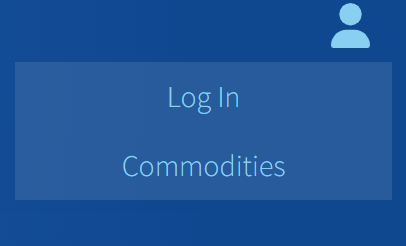
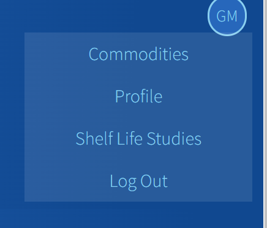

# postharvest-app-frontend

## User Flow

### App
- Returns **NavBar** and **Routes** wrapped in an **ItemContextProvider** with user, logged in and loading variables.

### NavBar
- Appears at the top of every page: 
  
  
  - **User Logged Out:**
    - Button with Windham logo on the left that is a link to Home. 
    - Button with user logo on the right that is a drop down menu with links to the following Routes:
      -  Login 
      -  Commodities
  
   
  - **User Logged In:**
    - Button with Windham logo on the left that is a link to Home. 
    - Button with user initials on the right that is a drop down menu with links to the following Routes:
      - Commodities
      - Profile 
      - Shelf Life Studies (Only admin can see)
      - Logout

### Routes and Components

#### Path: '/' - Component: Home
- useEffect hook to call PostharvestApi.getCommodities() before loading and sets commodities state to result

**Components**
- **CommoditySearchForm**: Shows a basic search bar for commodities. Calls PostharvestApi.getCommodities(formData) onSubmit and returns array of filtered commodities
- **CardGroup**: 
  - **Cards** of commodity name and variety appear upon search, user can click card to to to commodity page

#### Path: '/login' - Component: Login
**Components**:
- **Form** => onSubmit call Postharvest.Api.login(), logs the user in

#### Path: '/signup' - Component: Signup
**Components**:
- **Form**: onSubmit call Postharvest.Api.register(), registers the user and logs them in

#### Path: '/logout' - Component: Logout
- clears localStorage 
- calls PostharvestApi.logout()
- Navigates to **Home**

#### Path: '/profile' - Component: Profile
**Components**:
- **Form**:
  - Allows user to see and edit their profile information. 
  - Profile form onSubmit call Postharvest.Api.updateUser()
  - Must confirm password before sending patch request to db
- **Modal**: Appears when user submits update form. Prompts user to enter their current password. If correct, calls updateUser() from API

#### Path: '/search' - Component: CommoditiesList
- useEffect hook to call PostharvestApi.getCommodities() before loading and sets commodities state to result

**Components**:
- **CommoditySearchForm**: Shows a basic search bar for commodities. Calls PostharvestApi.getCommodities(formData) onSubmit and returns array of filtered commodities
- **ListGroup**
  - Displays list of commodities. 
  - Each **ListGroupItem** is a link that directs the user to '/commodity/:id' 
- **Modal**:
  - **AddCommodityForm**: Admins can add commodity to the db, page refreshes and shows up in ListGroup when successful
  

#### Path: '/commodity/:id' Component: Commodity
- useEffect hook to call PostharvestApi.getCommodity(id) before loading and sets commodities state to result
  - All users see all components associated with commodity except for Studies
**Components**:
- Edit button => onClick displays **Modal** 
  - *only visible if user.current isAdmin*
  - **EditCommodityForm**: onSubmit calls editCommodity(id, data) from API
- **TemperatureData**: table showing data from commodity.temperatureRecommendations. If there's no data, shows 'No Data Entered yet'.
  - Admins can see an add and edit button.
    - Add button shows **AddTemperatureForm** component in Modal. On submit calls addTempRec from API
    - Edit button shows:
      - **EditTempForm** in Modal. onSubmit calls updateTempRec() from API. 
    - Delete button: onClick calls deleteTempRec from API
- **ShelfLifeData**: similar to TemperatureData with ShelfLife data and Api methods
- **RespirationData**: similar to TemperatureData with Respiration Rate data and Api methods
- **EthyleneData**: similar to TemperatureData with Ethylene data and Api methods
- **WindhamStudies**: *only visible if user.current isAdmin*. similar to TemperatureData with WindhamStudy data and Api methods. Includes a button for user to download study from S3 Bucket.
- **ReferenceData**: similar to TemperatureData with Reference data and Api methods. Only includes options to an add and delete references.  
- Delete button => onClick displays **Modal**: 
  - Asks user if they're sure they want to delete commodity. 
  - Modal Button on click calls deleteCommodity(id) from API

#### Path: '/studies-list' Component: StudiesList
- Authorization required: admin
  - If not admin, redirect to '/'
- useEffect on load calls getStudies() from API. Set up to eventually add a search bar component.

**Components**:
- Add button onClick shows **Modal**:
  - **AddWindhamStudyForm**, onClick calls addStudy() from API
- Edit Button onClick shows edit and delete buttons next to each study listed
  - Edit Button onClick displays Modal with **EditWindhamStudyForm**. onSubmit calls updateStudy from API
  - Delete button onClick calls deleteStudy from API
- **Table**
  - Display list of all Windham Packaging studies. Show title, data, objective, commodities (with link going to /commodity/:id), and button to download.
  - Edit Commodities button onClick shows Modal with **EditWindhamStudiesCommodities**.
    - Check list of all commodities in the db. 
    - If commodity is already associated with study, that commmodity is checked.
    - User can check and uncheck any commodity to associate or remove that commodity association
    - onSubmit calls clearCommoditiesFromStudy() and/or addCommoditiesToStudy() from API
- To do: connect S3 bucket to Heroku via Bucketeer

#### Path: '*'  - Component: NotFound
- Displays 404 page when page not found

## API
**token**: Stores token for auth
**request**: Accepts endpoint, data, and method as arguments. Generates a url, headers using this.token, and params using method and data. Makes an axios request using {url, method, data, params, headers}
### User
- **getUser**: Returns user information given a username. username => {username, password, firstName, lastName, email, jobTitle}
- **register**: Allows a user to sign up for an account. {username, password, firstName, lastName, email, jobTitle} => {JWT token}. uses getUser() to return user info. Logs in user automatically after successfully registering. Stores token and username to localStorage
- **login**: Allows a user to log in by generating a token and passing that token as a header. {username, password} => {JWT token}. uses getUser() to return user info. Stores token and username to localStorage
- **logout**: Allows a user to log out. Clears localStorage and resets this.token to undefined
- **updateUser**: Allows a user update their information. Can be a partial update. Automatically updates user information by logging them out and logging them back in with updated information.

### Commodity
- **getCommodities**: Get a list of commodities from commodities table.
- **getCommodity**: Get a single commodity and its details, given a commodity id
- **addCommodity**: Add a new commodity
- **editCommodity**: Edit a commodity given an id
- **deleteCommodity**: Delete a commodity given an id
  

### Temperature Recommendations
- **addTempRec**: Add a temperature recommendation to temperature_recommendations given a commodity id and data
- **updateTempRec**: Update a temperature recommendation in temperature_recommendations given an id
- **deleteTempRec**: Delete temperarture recommendation given temperature id

### Shelf Life
- **addShelfLifeData**: Add a shelf life data to shelf_life
- **updateShelfLifeData**: Update shelf life data in shelf_lifes given an id
- **deleteShelfLifeData**: Delete shelf life data given an id

### Respiration Rate
- **addRespirationData**: Add a respiration data to respiration_rates
- **updateRespirationData**: Update shelf life data in respiration_rates given an id
- **deleteRespirationData**: Delete respiration data

### Ethylene Sensitivity
- **addEthyleneData**: Add  ethylene data to ethylene_sensitivity
- **updateEthyleneData**: Update a ethylene data in ethylene_sensitivity given an id
- **deleteEthyleneData**: Delete ethylene data

### Windham Shelf Life Studies
- **getStudy**: get study by id
- **getStudies**: get all studies
- **addStudy**: add a new study (not applied yet)
- **updateStudy**: Update study title, date, or objective in windham_studies given an id
- **deleteStudy**: Delete shelf life study from windham_studies
- **addCommoditiesToStudy**: Add to windham_studies_commodities
- **clearCommoditiesFromStudy**: Delete all commodity-study data from windham_studies_commodities

### References
- **addReference**: Add  references to refs table in db
- **deleteReference**: Delete reference from refs table in db

## Tech Stack
### Libraries
- React
- React Router DOM
- Axios
- FontAwesome

  
### Frameworks
- Bootstrap/Reactstrap

### NPM Packages
- UUID
