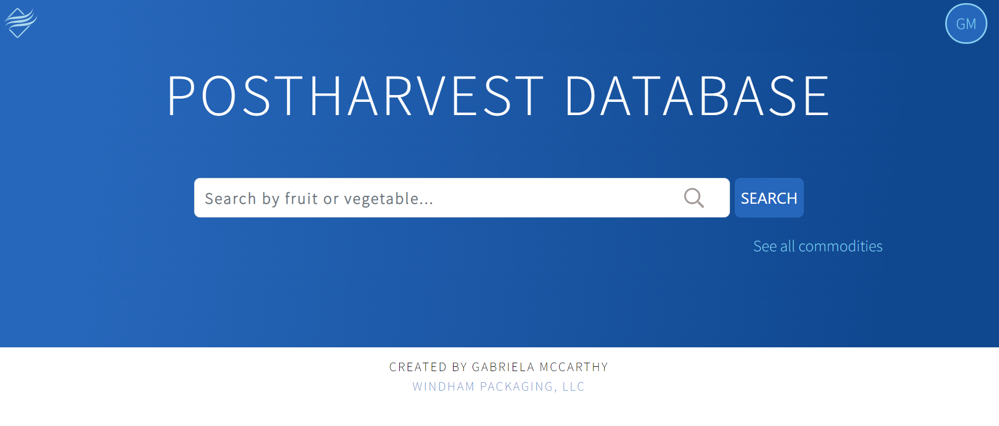
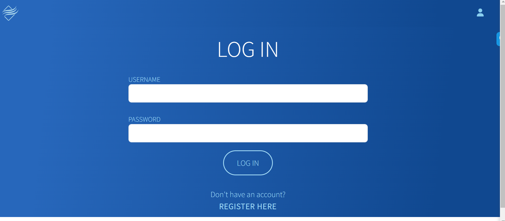
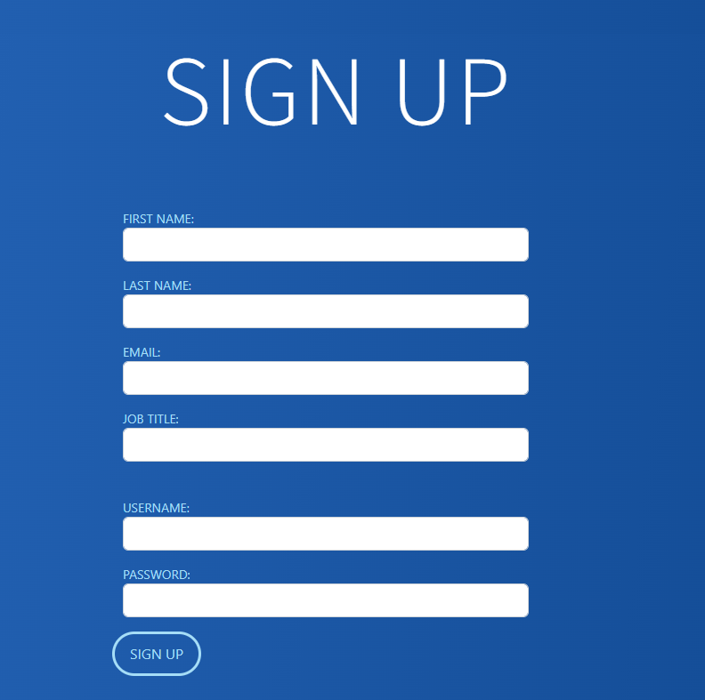
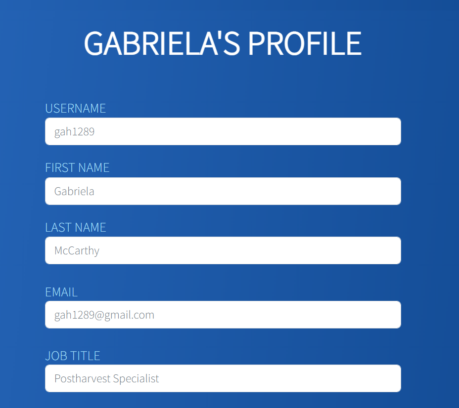
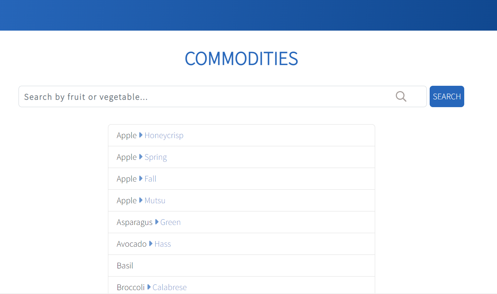
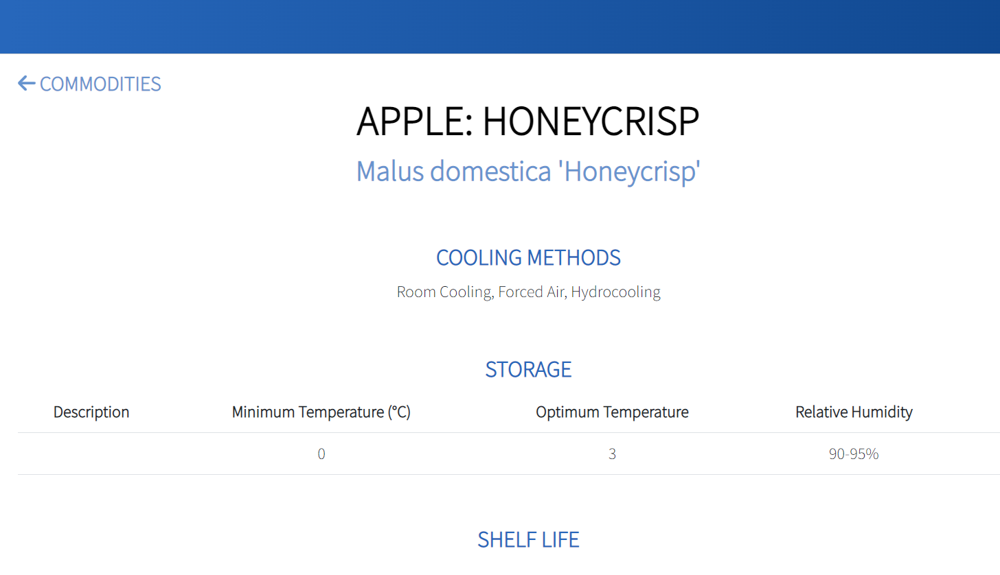
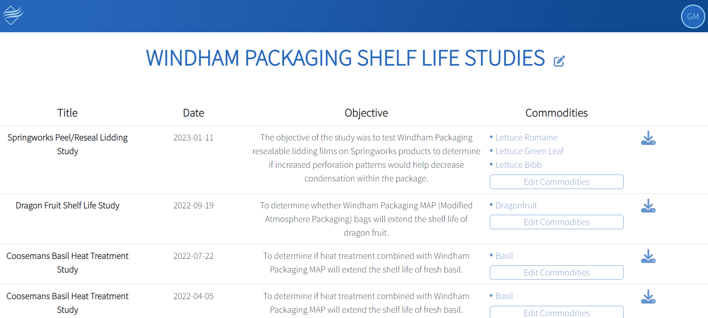

# postharvest-app-frontend

## User Flow
### NavBar
- Appears at the top of every page:
  - User Logged Out: 
    - Button with Windham logo on the left that is a link to Home. 
    - Button with user logo on the right that is a drop down menu with links to the following Routes:
      -  Login 
  - User Logged In:
    - Button with Windham logo on the left that is a link to Home. 
    - Button with user initials on the right that is a drop down menu with links to the following Routes:
      - Profile 
      - Logout

### Routes

#### /
- Shows a basic search bar for commodities.

#### /login
- Login form => onSubmit call Postharvest.Api.login(), logs the user in

#### /signup
- Register form onSubmit call Postharvest.Api.register(), resisters the user and logs them in

#### /profile
- Allows user to see and edit their profile information. 
- Profile foorm onSubmit call Postharvest.Api.updateUser()
- Must confirm password before sending patch request to db

#### /search
- Displays list of commodities. 
- Filter by name
- Each Item on the list is a link that directs the user to '/commodity/:id' 
- Admins can add, update, or delete commodities

#### /commodity/:id
  - Users and anon can see all information associated with commodity
 - Admins can add, update, and delete temperature recommendations, shelf life, ethylene, and respiration information
 - Admins can see and download associated shelf life studies

#### /studies-list
- Authorization required: admin
  - If not admin, redirect to '/'
- Display list of all Windham Packaging studies. Show title, data, objective, commodities (with link going to /commodity/:id), and button to download.
- Edit button - reveals buttons to edit and delete each study
- Edit commodities - reveals check list of all commodities. Allow user to set and update all commodities associated with the study
- To do: add the ability to add studies

## API
**token**: Stores token for auth
**request**: Accepts endpoint, data, and method as arguments. Generates a url, headers using this.token, and params using method and data. Makes an axios request using {url, method, data, params, headers}
### User
- **getUser**: Returns user information given a username. username => {username, password, firstName, lastName, email, jobTitle}
- **register**: Allows a user to sign up for an account. {username, password, firstName, lastName, email, jobTitle} => {JWT token}. uses getUser() to return user info. Logs in user automatically after successfully registering. Stores token and username to localStorage
- **login**: Allows a user to log in by generating a token and passing that token as a header. {username, password} => {JWT token}. uses getUser() to return user info. Stores token and username to localStorage
- **logout**: Allows a user to log out. Clears localStorage and resets this.token to undefined
- **updateUser**: Allows a user update their information. Can be a partial update. Automatically updates user information by logging them out and logging them back in with updated information.

### Commodity
- **getCommodities**: Get a list of commodities from commodities table.
- **getCommodity**: Get a single commodity and its details, given a commodity id
- **addCommodity**: Add a new commodity
- **editCommodity**: Edit a commodity given an id
- **deleteCommodity**: Delete a commodity given an id
  

### Temperature Recommendations
- **addTempRec**: Add a temperature recommendation to temperature_recommendations given a commodity id and data
- **updateTempRec**: Update a temperature recommendation in temperature_recommendations given an id
- **deleteTempRec**: Delete temperarture recommendation given temperature id

### Shelf Life
- **addShelfLifeData**: Add a shelf life data to shelf_life
- **updateShelfLifeData**: Update shelf life data in shelf_lifes given an id
- **deleteShelfLifeData**: Delete shelf life data given an id

### Respiration Rate
- **addRespirationData**: Add a respiration data to respiration_rates
- **updateRespirationData**: Update shelf life data in respiration_rates given an id
- **deleteRespirationData**: Delete respiration data

### Ethylene Sensitivity
- **addEthyleneData**: Add  ethylene data to ethylene_sensitivity
- **updateEthyleneData**: Update a ethylene data in ethylene_sensitivity given an id
- **deleteEthyleneData**: Delete ethylene data

### Windham Shelf Life Studies
- **getStudy**: get study by id
- **getStudies**: get all studies
- **addStudy**: add a new study (not applied yet)
- **updateStudy**: Update study title, date, or objective in windham_studies given an id
- **deleteStudy**: Delete shelf life study from windham_studies
- **addCommoditiesToShelflife**: Add to windham_studies_commodities
-  **clearCommoditiesFromStudy**: Delete all commodity-study data from windham_studies_commodities

### References
- **addReference**: Add  references to refs table in db
- **deleteReference**: Delete reference from refs table in db